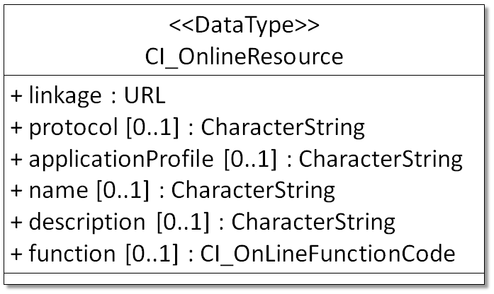

# CI OnlineResource

_ISO Usage: 1 = Mandatory, 0...1 = Optional_

| # | Element      | ISO Usage | Definition and Recommended Practice
| - | ------------ | -------- | -------------------
| 1 | [linkage](/jpa-prototype/CharacterString) | 1 | **_Internet address which uses a Uniform Resource Locator address or similar addressing scheme. Provide complete address to active URL. Do not provide URLs in other elements._**  `Examples`   [https://www.noaa.gov/](https://www.noaa.gov/)    [https://www.ncei.noaa.gov/](https://www.ncei.noaa.gov/) |
| 2 | [protocol](/jpa-prototype/CharacterString) | 0...1 | **_The connection protocol to be used. When applicable, use the identifier values in this codelist hosted by Open Source Geospatial Foundation._**   |
| 3 | [applicationProfile](/CharacterString) | 0...1 | Name of an application profile that can be used with the online resource. |
| 4 | [name](/CharacterString) | 0...1 | Title of the online resource. For HTML pages, use the html title tag. Recommend providing at least a name or a description.   |
| 5 | [description](/CharacterString) | 0...1 | 1	Brief text explaining content or purpose of online resource. Recommend providing at least a name or a description.Example: NOAA homepage  |
| 6 | [function](/jpa-prototype/ISO_19115_and_19115-2_CodeList_Dictionaries) | 0...1 | Categorize the purpose of this online resource. Use 'download' for direct access to files or ftp sites. Use 'information' for pages with only descriptive information about the resource. Use 'search' for interfaces that support users interaction to find the resource of interest.   |

## Community Requirements

*M = Mandatory; C = Conditional; R = Recommended; blank cell = user discretion*

# NOAA Rubric
| Community  | Element | M/C/R | Notes
| - | - | - | -
NOAA Completeness Rubric V2 | linkage | M |
NOAA Completeness Rubric V2 | protocol | C | Required when the URL is for Data Access
NOAA Completeness Rubric V2 | applicationProfile | - |
NOAA Completeness Rubric V2 | name | C | Provide if description field is null.
NOAA Completeness Rubric V2 | description | C | Provide if name field is null.
NOAA Completeness Rubric V2 | function | M |

# OneStop Project
OneStop Project| linkage | M |
OneStop Project | protocol | C | Required when the URL is for Data Access
OneStop Project| applicationProfile | - |
OneStop Project| name | C | Provide if description field is null.
OneStop Project | description | C | Provide if name field is null.
OneStop Project | function | M |

### UML(Unified Modeling Language) Image

## XML Examples 

>  &nbsp;  
>    \<gmd:CI_OnlineResource>  
>       &nbsp;    \<gmd:linkage>  
>   &nbsp; &nbsp;  \<gmd:URL> http://www.ngdc.noaa.gov/dem/squareCellGrid/download/258 </gmd:URL>  
>    &nbsp;   </gmd:linkage>  
>     &nbsp; \<gmd:name>  
>      &nbsp; &nbsp; \<gco:CharacterString> Adak, AK 1 arc-second Tsunami Inundation DEM </gco:CharacterString>  
>     &nbsp;  \</gmd:name>  
>     &nbsp; \<gmd:description>  
>     &nbsp; &nbsp;  \<gco:CharacterString> Download page for accessing DEM, metadata record and development report. </gco:CharacterString>  
>     &nbsp; \</gmd:description>  
>     &nbsp; \<gmd:function>   
>     &nbsp; &nbsp;  \<gmd:CI_OnLineFunctionCode codeList="http://www.ngdc.noaa.gov/metadata/published/xsd/schema/resources/Codelist/gmxCodelists.xml#CI_OnLineFunctionCode" codeListValue="download">  
>        &nbsp; &nbsp; &nbsp; download    
>      &nbsp; &nbsp; \</gmd:CI_OnLineFunctionCode>  
>    &nbsp;   \</gmd:function>  
>     \</gmd:CI_OnlineResource>  
>  &nbsp;  
